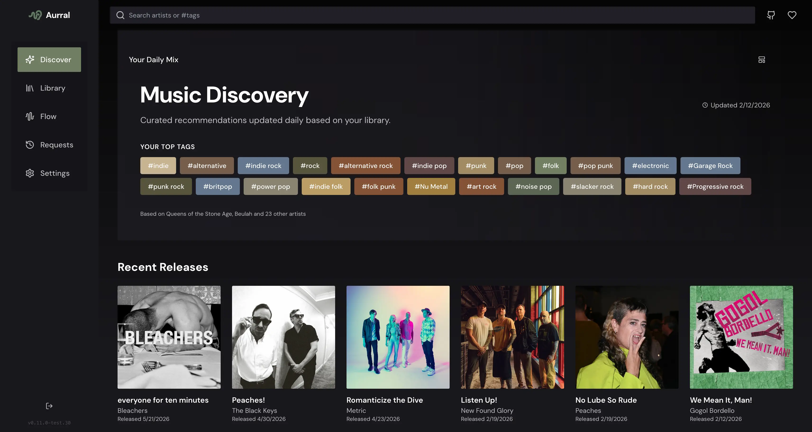
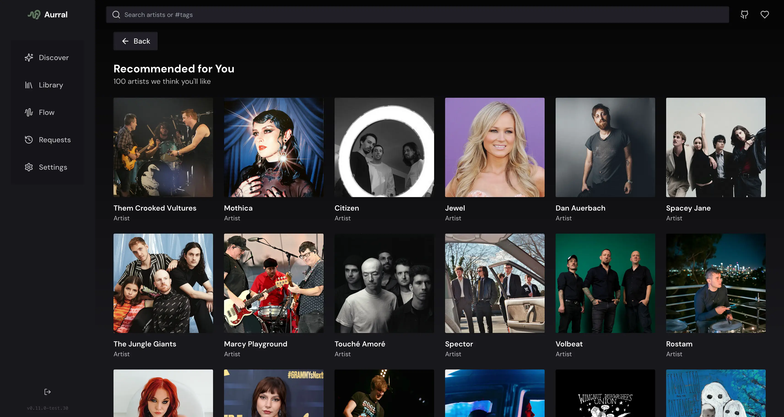
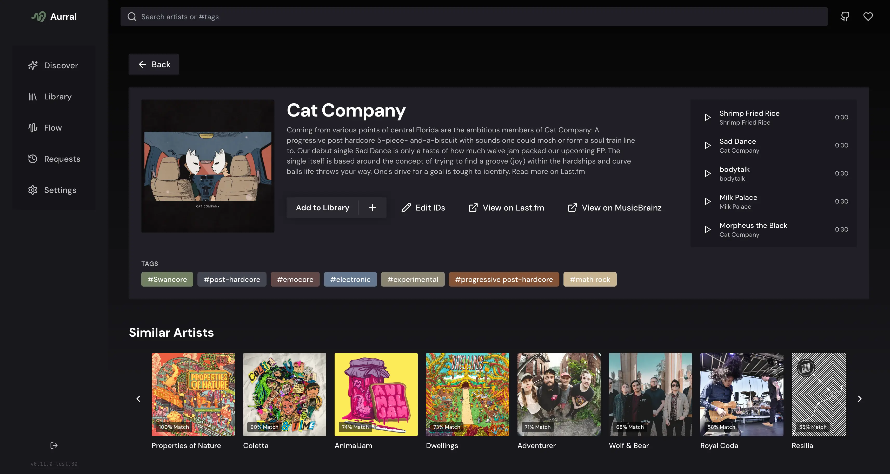

<div align="center" width="100%">
  
</div>

# Aurral

[](https://ghcr.io/lklynet/aurral)  [](LICENSE)
[](https://github.com/lklynet/aurral/actions/workflows/docker-publish.yml)  [](https://github.com/lklynet/aurral/discussions) 

Self-hosted music discovery and request management for Lidarr — with library-aware recommendations, granular monitoring controls, and optional Weekly Flow playlists powered by Soulseek + Navidrome.

---

## Screenshots

<p align="center">
  
</p>

<p align="center">
  
  
</p>

---

## Notice: Test branch transition

We’re actively developing a new test branch with a rebuilt app and a single combined container image. It will merge into `main` in the coming weeks.

Please start transitioning to the test-branch `docker-compose` or pin your current deployment to a specific image tag instead of `latest` to avoid breaking changes during the merge.

Test branch details: https://github.com/lklynet/aurral/tree/test

---

## What is Aurral?

- Search for artists via MusicBrainz and add them to Lidarr with the monitoring behavior you want
- Browse your existing library in a clean UI
- Discover new artists using recommendations derived from your library and (optionally) Last.fm
- Track requests and download/import progress
- Generate weekly playlists and download the tracks into a separate “Weekly Flow” library

Aurral is designed to be safe for your collection: it does not write into your main music library directly. Library changes go through Lidarr’s API, and Weekly Flow writes into its own directory.

---

## Features

### Discovery & Search

- Real-time artist search (MusicBrainz)
- Daily Discover recommendations based on your library, tags, and trends
- Deep artist pages (types, tags, release groups, tracklists)
- Artist/album art enrichment (optional Last.fm, plus fallback sources)

### Lidarr Management

- Add artists with granular monitor options (None / All / Future / Missing / Latest / First)
- Add specific albums from release groups
- Optional “search on add” behavior for immediate Lidarr searches
- Library view with quick navigation into artist details
- Request tracking with queue/history awareness

### Weekly Flow (Optional)

Weekly Flow generates playlists from your library and listening context, then downloads tracks via a built-in Soulseek client into a dedicated folder.

- Multiple flows with adjustable mix (Discover / Mix / Trending) and size
- Automatic weekly refresh scheduling
- Download state tracking (queued → downloading → processing → added/failed)
- Optional Navidrome smart playlists and a dedicated “Aurral Weekly Flow” library

### Users, Auth, and Permissions

- First-run onboarding creates an admin account
- Multiple local users with roles and granular permissions
- Optional authentication via reverse-proxy headers (for OAuth2/OIDC setups)

### Notifications

- Gotify notifications for key events (e.g. Discover updates, Weekly Flow completion)

### PWA Support

- Installable web app (PWA) with auto-update support

---

## Requirements

### Required

- Lidarr (reachable from Aurral)
- A MusicBrainz contact email (used for the MusicBrainz User-Agent policy)

### Recommended

- Last.fm API key (better discovery + imagery coverage)

### For Weekly Flow

- Navidrome (optional but recommended if you want playlist/library integration)
- A downloads directory mounted into the container (for the Weekly Flow library)

---

## Quick Start (Docker Compose)

This is the recommended deployment. It runs Aurral as a single container (frontend + backend).

Create a `docker-compose.yml`:

```yaml
services:
  aurral:
    image: ghcr.io/lklynet/aurral:latest
    restart: unless-stopped
    ports:
      - "3001:3001"
    environment:
      - DOWNLOAD_FOLDER=/data/downloads/tmp
    volumes:
      - /data/downloads/tmp:/app/downloads
      - ./data:/app/backend/data
```

Start it:

```bash
docker compose up -d
```

Open: http://localhost:3001

---

## First-Run Setup (Onboarding)

On first launch, Aurral guides you through:

1. Creating your admin account
2. Connecting Lidarr
3. Setting your MusicBrainz contact email
4. (Optional) Connecting Last.fm, Navidrome, and Gotify

Everything can be adjusted later in Settings.

---

## Data, Volumes, and Safety

### Persistent data

Mount this to persist users, settings, discovery cache, and job tracking:

- Container path: `/app/backend/data`
- Recommended bind mount: `./data:/app/backend/data`
- Database file: `/app/backend/data/aurral.db`

### Downloads and Weekly Flow library

Mount a downloads folder for Weekly Flow and optional Navidrome integration:

- Container path: `/app/downloads`
- Weekly Flow output: `/app/downloads/aurral-weekly-flow/<flow-id>/<artist>/<album>/<track>`

### A note on your main library

Aurral does not write to your root music folder directly. Changes to your main collection happen via Lidarr (add/monitor/request/import).

---

## Weekly Flow + Navidrome Setup (Optional)

If you want Weekly Flow to appear as a separate library inside Navidrome:

1. In Aurral: Settings → Integrations → Navidrome (URL, username, password)
2. Ensure your compose config maps a host folder into `/app/downloads`
3. Set `DOWNLOAD_FOLDER` to the same host path you mapped in the volume

Example:

- Volume: `/data/downloads/tmp:/app/downloads`
- Env: `DOWNLOAD_FOLDER=/data/downloads/tmp`

Aurral will:

- Create a Navidrome library pointing to `<DOWNLOAD_FOLDER>/aurral-weekly-flow`
- Write smart playlist files (`.nsp`) into the Weekly Flow library folder

Navidrome should be configured to purge missing tracks so Weekly Flow rotations don’t leave stale entries:

- `ND_SCANNER_PURGEMISSING=always` (or `full`)

---

## Authentication & Reverse Proxy

### Local users (default)

Aurral uses local user accounts created in onboarding. Authentication is HTTP Basic Auth at the API layer. Use HTTPS when exposing it publicly.

### Reverse-proxy auth (OAuth2/OIDC)

If you want SSO, place Aurral behind an auth-aware reverse proxy and forward the authenticated username in a header.

Environment variables:

```bash
AUTH_PROXY_ENABLED=true
AUTH_PROXY_HEADER=X-Forwarded-User
AUTH_PROXY_TRUSTED_IPS=10.0.0.1,10.0.0.2
AUTH_PROXY_ADMIN_USERS=alice,bob
AUTH_PROXY_ROLE_HEADER=X-Forwarded-Role
AUTH_PROXY_DEFAULT_ROLE=user
```

### Proxy headers (trust proxy)

If you are behind a reverse proxy, set `TRUST_PROXY` so Aurral interprets `X-Forwarded-*` correctly:

```bash
TRUST_PROXY=true
```

---

## Configuration Reference (Environment Variables)

Most configuration is done in the web UI, but some settings are controlled by environment variables.

| Variable | Purpose | Default |
|---|---|---|
| `PORT` | HTTP port | `3001` |
| `TRUST_PROXY` | Express trust proxy setting (`true`/`false`/number) | `1` |
| `DOWNLOAD_FOLDER` | Host path used for Navidrome Weekly Flow library | `/data/downloads/tmp` |
| `PUID` / `PGID` | Run container as this UID/GID (when starting as root) | `1001/1001` |
| `LIDARR_INSECURE` | Allow invalid TLS certificates (`true`/`1`) | unset |
| `LIDARR_TIMEOUT_MS` | Lidarr request timeout | `8000` |
| `SOULSEEK_USERNAME` / `SOULSEEK_PASSWORD` | Optional fixed Soulseek creds | autogenerated if missing |
| `AUTH_PROXY_*` | Reverse-proxy auth options (above) | unset |

---

## Updating

### Docker Compose update

1. Back up your `./data` folder (contains `aurral.db`)
2. Pull the new image and recreate the container:

```bash
docker compose pull
docker compose up -d
```

If you pin versions, update the image tag instead of using `latest`.

---

## Migration Notes (Legacy → Rewritten App)

If you are coming from the original Aurral (separate frontend/backend containers and `.env`-driven setup):

- Treat this as a fresh install; complete onboarding again
- Keep the new `./data` volume separate from the legacy app’s data
- Port is `3001` by default
- Most config lives in Settings now (integrations, quality presets, release types, etc.)

---

## Troubleshooting

- Lidarr connection fails: confirm Lidarr URL is reachable and API key is correct (Settings → Integrations → Lidarr)
- Discovery looks empty: add some artists to Lidarr and/or configure Last.fm; initial discovery refresh can take a bit
- MusicBrainz is slow: MusicBrainz is rate-limited; Aurral respects it and may take longer on first runs
- Weekly Flow does not show in Navidrome: verify `DOWNLOAD_FOLDER` matches your host path mapping and Navidrome purge settings
- Permission errors writing `./data`: set `PUID`/`PGID` to match your host directory ownership

---

## Support

- Community + questions: https://discord.gg/muWFBBMn
- Troubleshooting + help: https://github.com/lklynet/aurral/discussions
- Bugs + feature requests: https://github.com/lklynet/aurral/issues

---

## Development

### Local dev

```bash
npm run install:all
npm run dev
```

- Backend: http://localhost:3001
- Frontend dev server: http://localhost:3000 (proxies `/api` and `/ws` to the backend)

### Build production frontend

```bash
npm run build
npm start
```

---

## License

MIT — see [LICENSE](LICENSE).
